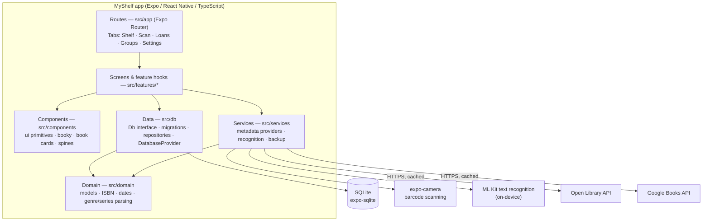
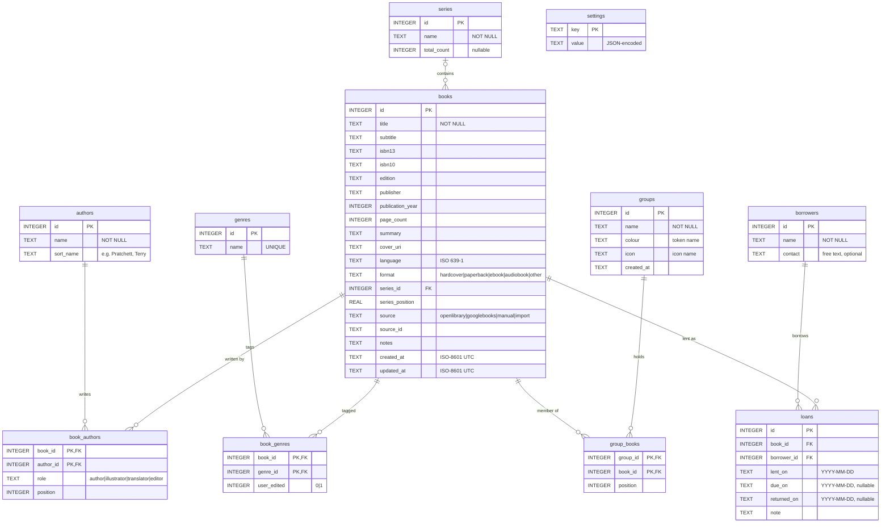
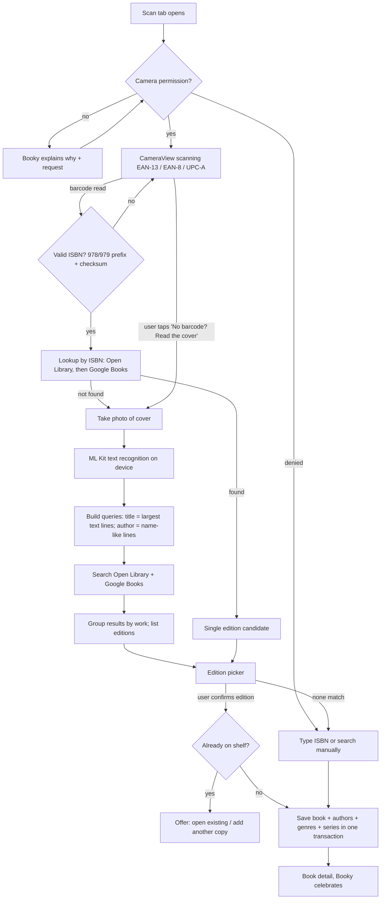

# MyShelf — Project Plan

MyShelf is a free, open-source, Android-first app for cataloguing a personal book collection. Point the camera at a book, and MyShelf identifies the exact edition, fills in the details (author, year, genre, summary, series and position), and puts it on your shelf. It also tracks books you lend to friends, and lets you browse by genre, series, author or your own groups — all in a cosy purple "little library" look, with a friendly bookmark helper called **Booky**.

This document is the entry point for anyone (human or automated agent) working on the project. Read it, then [`STATUS.md`](STATUS.md), then the phase document for the task you are picking up in [`docs/plan/`](docs/plan/). Architectural decisions are recorded in [`docs/adr/`](docs/adr/).

---

## Contents

1. [Goals and non-goals](#1-goals-and-non-goals)
2. [Architecture](#2-architecture)
3. [Tech stack](#3-tech-stack)
4. [Repository layout](#4-repository-layout)
5. [Data model](#5-data-model)
6. [External APIs](#6-external-apis)
7. [Recognition pipeline](#7-recognition-pipeline)
8. [Booky, the helper](#8-booky-the-helper)
9. [Theme and design tokens](#9-theme-and-design-tokens)
10. [Testing strategy](#10-testing-strategy)
11. [Phases](#11-phases)
12. [Definition of done](#12-definition-of-done)
13. [ADR index](#13-adr-index)

---

## 1. Goals and non-goals

### Goals

- **Scan to catalogue.** Identify a book *and its edition* from the camera: barcode (ISBN) first, cover-text OCR as a fallback, then let the user confirm the edition from a candidate list.
- **Rich metadata, user in control.** Title, subtitle, authors, publisher, publication year, page count, a brief summary, genres (editable), series and series position, cover image.
- **Lending tracker.** Who has which book, since when, when it is due, and when it came back.
- **Browse your way.** Group the shelf by genre, series, author, or user-created groups.
- **Delightful and accessible.** A cute purple theme that could sit on a library counter; Booky offers tips, onboarding and help; WCAG AA contrast, screen-reader support and large-text support throughout.
- **Free to build and run.** No paid services, no backend, no accounts. Data lives on the device in SQLite, with export/import for backup.
- **Portfolio quality.** Public repo, readable history, documented decisions, automated tests at three levels, CI.

### Non-goals (for v1)

- Cloud sync, accounts, or multi-device sharing (export/import covers backup — see [ADR 0012](docs/adr/0012-local-only-data.md)).
- iOS release (the code stays cross-platform; only Android is built, tested and released).
- Reading progress tracking, ratings/reviews, social features.
- Any paid API, API key that costs money, or self-hosted server.

---

## 2. Architecture

MyShelf is a single Expo React Native app. There is no server: the app talks directly to two free public book APIs and stores everything in an on-device SQLite database.



### Layering rules

| Layer | Folder | May import | Must not import |
|---|---|---|---|
| Routes | `src/app` | `src/features` (a route file re-exports one screen); the root `_layout.tsx` also wires the providers from `src/theme`, `src/db` and `src/components/booky` | — |
| Screens and feature hooks | `src/features/<feature>` | `src/components`, `src/db`, `src/services`, `src/domain`, `src/theme`, `src/testing`, `expo-router` | `src/app`; SQL |
| Components | `src/components` | `src/theme`, `src/domain`, `src/hooks`, `src/testing` (test ids) | `src/db`, `src/services`, `src/features` (take data via props/hooks) |
| Services | `src/services` | `src/domain` | `src/db`, React components |
| Domain | `src/domain` | nothing app-specific (pure TS) | React, Expo, `src/db` |
| Data | `src/db` | `src/domain`; `expo-sqlite` in the adapter `expo.ts` only; React in `DatabaseProvider.tsx` only | `src/components`, `src/features`, `src/app`; other Expo modules |

`DatabaseProvider` (`src/db/DatabaseProvider.tsx`) is the one React module in the data layer. It lives next to the adapters and `migrate()` it calls: it opens the database, runs the migrations and provides the `Db` through `useDatabase()`. It renders no UI of its own; the root layout passes in the loading and error screens (from `src/features/navigation`), so the data layer never imports components.

- **Domain is pure.** Everything in `src/domain` is plain TypeScript with no React/Expo imports, so it is trivially unit-testable.
- **The database is behind a small `Db` interface** ([ADR 0005](docs/adr/0005-sqlite-with-migrations-and-db-interface.md)). The app uses an `expo-sqlite` adapter (`src/db/expo.ts`); Jest uses a `node:sqlite` adapter (`src/db/node.ts`) so repositories are tested against a real SQLite engine. Both wrap a raw connection with `createDb()`, which queues statements behind open transactions and turns nested transactions into savepoints.
- **Platform differences are isolated** in files with platform extensions (today `src/theme/cssVars.web.ts`, `src/db/pragmas.web.ts`; later e.g. `ocr.native.ts` / `ocr.web.ts`), never in `if (Platform.OS …)` branches scattered through screens.
- **Routes are thin.** A route file re-exports a screen from `src/features` (`src/app/(tabs)/index.tsx` → `ShelfScreen`); screens compose components and feature hooks, and business logic lives in `src/features`, `src/services` and `src/domain`.
- **State.** React state + context, plus small feature hooks that read from repositories and refresh on change events. No global state library in v1; revisit only with an ADR.

### Navigation

The root stack (`src/app/_layout.tsx`) holds the tab group and `+not-found`. It keeps the native splash screen up until the fonts are loaded and the database is open and migrated; meanwhile (and on web, which has no native splash) it shows the loading screen, and if the database cannot be opened, an error screen with a retry button.

Tabs (`src/features/navigation/TabsLayout.tsx`) render **only the focused tab's screen**; inactive tabs are unmounted. React Navigation otherwise keeps visited tabs mounted (on web, stacked in the DOM behind the active one), which would leave several `h1`s and page-state markers in the document at once. The trade-off: a tab loses its local state (scroll position, typed input) when the user switches away. Tab screens hold no such state yet; revisit this when one needs to keep it.

### Web target

The app also runs in a browser via `react-native-web` (`npm run web`, `npm run export:web`). The web build is **not a product**: it exists so the TypeScript + Playwright **auto test suite** (`tools/auto-test-suite`) can drive, assert on and screenshot every screen quickly and deterministically in CI ([ADR 0002](docs/adr/0002-web-target-for-automated-ui-testing.md)). Features that need native modules (camera, ML Kit) have web stubs that accept typed input instead, and are exercised on device by Maestro.

- **Page template.** With `web.output: "single"`, Expo Router ignores `src/app/+html.tsx`, so the HTML shell is `public/index.html`: `lang="en"`, the viewport meta, and body background, text colour and font taken from the `--ms-*` tokens (with fallbacks for the moment before the bundle runs).
- **Cross-origin isolation.** `expo-sqlite` on web runs SQLite as WebAssembly and needs `SharedArrayBuffer`, which browsers only enable on cross-origin isolated pages. `metro.config.js` registers `.wasm` as an asset and adds `Cross-Origin-Opener-Policy: same-origin` and `Cross-Origin-Embedder-Policy: credentialless` to every response the dev server writes. (Metro's `server.enhanceMiddleware` hook is not enough: it only wraps Metro's own handler, which runs after the Expo CLI has already served `index.html`.) The `expo-router` plugin in `app.json` declares the same headers for hosted output, and the auto test suite's `--serve` will send them for a static export (P00-21). `credentialless` rather than `require-corp` keeps remote cover images loadable.

---

## 3. Tech stack

Versions below are what is installed on `main` today (from `package-lock.json`). Rows marked *planned* are added in the named task with `npx expo install`, which picks the SDK-compatible version; record the resolved version here when the task lands.

| Area | Choice | Version | Notes |
|---|---|---|---|
| Runtime | Expo SDK | 57.0.25 | [ADR 0001](docs/adr/0001-expo-react-native-typescript.md) |
| UI framework | React Native | 0.86.3 | New Architecture (Expo default) |
| | React / React DOM | 19.2.3 | |
| Language | TypeScript | 6.0.3 | `strict: true`, path alias `@/*` → `src/*` |
| Navigation | Expo Router | 57.0.23 | file routes in `src/app`, typed routes enabled (types generated into `.expo/types` by the dev server, see §10.5) |
| Web | react-native-web | 0.21.3 | Metro bundler, `output: "single"` |
| Database | expo-sqlite | 57.0.3 | [ADR 0005](docs/adr/0005-sqlite-with-migrations-and-db-interface.md) |
| Fonts | expo-font, `@expo-google-fonts/lora`, `nunito`, `courier-prime` | 57.0.4 / 0.4.2 / 0.4.2 / 0.4.1 | each weight imported from its own subpath so only the weights in use are bundled |
| Splash | expo-splash-screen | 57.0.9 | held until fonts and database are ready |
| Unit tests | Jest / jest-expo | 29.7.0 / 57.0.5 | |
| Component tests | @testing-library/react-native | 13.3.3 | |
| Vector graphics | react-native-svg | 15.15.4 | Booky and library motifs |
| Icons | @expo/vector-icons | 15.1.1 | `MaterialCommunityIcons` (tab bar, close buttons) |
| Safe areas | react-native-safe-area-context | 5.7.0 | used by `Screen` and the tab bar |
| Images | expo-image | *planned* (P01-10) | cached cover images |
| Camera + barcodes | expo-camera | *planned* (P03-03) | `CameraView` barcode scanning (EAN-13) |
| OCR | @react-native-ml-kit/text-recognition | *planned* (P03-05) | on-device Google ML Kit; needs a development build |
| Dev builds | expo-dev-client | *planned* (P03-01) | |
| Files / sharing | expo-file-system, expo-sharing, expo-document-picker | *planned* (P02-09, P08-02) | covers cache, backups |
| Notifications | expo-notifications | *planned* (P05-08) | local due-date reminders only |
| UI test driver | auto test suite: TypeScript, Playwright (library) + Commander, run with tsx | 1.63.0 / 15.0.0 / 4.23.15 | `tools/auto-test-suite` (P00-15..P00-17, [ADR 0013](docs/adr/0013-typescript-auto-test-suite.md)); accessibility checks are its own `a11y` gate, no third-party engine |
| Device tests | Maestro CLI | *planned* (P00-18) | YAML flows in `.maestro/` |
| CI | GitHub Actions | — | free for public repos; `.github/workflows/ci.yml` (P00-19) |
| Node | Node.js | 22.13+ or 23.4+ (developed on 23.11.0; CI uses 23) | `node:sqlite` is used by the Jest Db adapter |

---

## 4. Repository layout

Items marked `[main]` exist on `main`; the rest are created by the task shown.

```text
MyShelf/
├── PLAN.md                     [main] this document
├── STATUS.md                   [main] task checklist
├── AGENTS.md                   [main] contributor / agent guide
├── README.md                   [main]
├── LICENSE                     [main] MIT
├── app.json                    [main] Expo config (package dev.asorichetti.myshelf, scheme myshelf)
├── eas.json                    P03-01 build profiles (development, preview, e2e, production)
├── package.json                [main] scripts incl. autotest / autotest:* for the auto test suite
├── tsconfig.json               [main]
├── metro.config.js             [main] `.wasm` assets; COOP/COEP headers on the dev server (expo-sqlite on web)
├── public/index.html           [main] web page template (lang, viewport, token fallbacks)
├── .githooks/commit-msg        [main] rejects AI/tool attribution in commit messages
├── .github/workflows/          [main] ci.yml (P00-19) · P09-07 release.yml
├── .maestro/                   P00-18 on-device flows (*.yaml)
├── assets/                     [main] icons, splash
├── docs/
│   ├── adr/                    [main] architecture decision records
│   ├── plan/                   [main] one document per phase
│   └── privacy.md              P09-09
├── scripts/
│   └── gen-selectors.mjs       [main] selectors.json → testids.gen.ts
├── src/
│   ├── app/                    [main] Expo Router routes (thin re-exports of screens in src/features)
│   │   ├── _layout.tsx         [main] root stack: fonts, splash, ThemeProvider, DatabaseProvider, BookyProvider
│   │   ├── +not-found.tsx      [main] unknown routes → NotFoundScreen
│   │   ├── (tabs)/             [main] _layout · index (Shelf) · scan · loans · groups · settings
│   │   ├── book/[id].tsx       P01-06
│   │   └── e2e/                P01-01 fixture loader, P03-07 scan injection (E2E builds only)
│   ├── components/
│   │   ├── ui/                 [main] Screen, Heading, Text, Button, Card, EmptyState, TextField; P00-30 IconButton, CatalogueCard, Chip, Stamp, ConfirmDialog, Snackbar
│   │   ├── booky/              [main] Booky, BookyBubble, BookyProvider (useBooky, BookyTipHost), expressions
│   │   └── book/               P01 BookRow, CoverImage, Spine …
│   ├── db/                     [main] Db interface (types.ts), createDb, adapters expo.ts · node.ts, migrate.ts, migrations/, repositories/, DatabaseProvider.tsx
│   ├── domain/                 [main] models + pure helpers (isbn, dates, author sort names …)
│   ├── features/               [main] screens + feature hooks: navigation/ (tabs, loading, database error, not found), shelf/, scan/, loans/, groups/, settings/
│   ├── hooks/                  [main] shared hooks (useReducedMotion)
│   ├── services/
│   │   ├── http/               P02-01 fetch wrapper
│   │   ├── metadata/           P02 Open Library + Google Books providers
│   │   ├── recognition/        P03 barcode + OCR
│   │   └── backup/             P08 export / import
│   ├── theme/                  [main] tokens, themes, ThemeProvider / useTheme, fonts, contrast helper, CSS custom properties
│   ├── testing/                [main] selectors.json, testids.gen.ts (generated), createTestDb, render helpers, Jest setup
│   └── __tests__/              [main] app-level tests (screens, tab navigation; feature tests live next to code)
└── tools/
    └── auto-test-suite/        [main] TypeScript + Playwright UI driver (P00-15..P00-17), see its README.md
        ├── README.md           usage, flags, gates, journeys (the tool's reference)
        └── src/
            ├── cli.ts          Commander entry point, global flags
            ├── selectors.ts    re-exports Testids from src/testing/testids.gen.ts; tid(id) → [data-testid="id"]
            ├── commands/       navigate · journey · smoke · screenshot · interact
            ├── browser/        Chromium lifecycle, console/network listeners, run bundle
            ├── uxgates/        pagestate · render · console · network · a11y; gates.config.json, console_allowlist.json
            └── journeys/       self-registering journeys, one file per area (test ids from src/testing/testids.gen.ts)
```

Test files live next to the code they test as `*.test.ts(x)` (or in a sibling `__tests__/` folder). `src/__tests__/` holds app-level tests that render routes through Expo Router (screens, tab navigation).

---

## 5. Data model

All data lives in one SQLite database on the device (`myshelf.db`). The schema below is the v1 design, created by `src/db/migrations/0001_init.ts`. **The migrations are the source of truth**; if this section and the migrations disagree, the migrations win and this section must be corrected in the same pull request.



### Rules and constraints

- **Schema version.** `migrate()` (`src/db/migrate.ts`) runs at every start. Each migration runs in its own transaction together with its row in a `schema_migrations` table (`version`, `name`, `applied_at`), and the version is mirrored in `PRAGMA user_version` so tools and backups can read it without a query. A failed migration leaves the database at the last good version; a database newer than the app is refused.
- **Foreign keys on.** `PRAGMA foreign_keys = ON` for every connection (plus `journal_mode = WAL` on Android/iOS; the web build has no WAL). Deleting a book cascades to `book_authors`, `book_genres`, `group_books` and `loans`; deleting a series sets `books.series_id` to `NULL`; deleting a borrower with loans is blocked (`ON DELETE RESTRICT`, surfaced as `BorrowerHasLoansError`; the UI offers to delete their returned-loan history first).
- **Checks in the schema.** Names and titles must not be blank; `isbn13`/`isbn10` must be 13/10 characters; `format`, `source` and `book_authors.role` are limited to the values above; `due_on` and `returned_on` cannot be before `lent_on`.
- **At most one open loan per book**: `CREATE UNIQUE INDEX loans_one_open_per_book ON loans(book_id) WHERE returned_on IS NULL;`. Repositories surface a violation as a typed `BookAlreadyOnLoanError`.
- **ISBNs are stored normalised**: digits only (plus a trailing `X` for ISBN-10), validated with checksums in `src/domain/isbn.ts`. `isbn13` is indexed (not unique: a user may own two copies).
- **`series_position` is `REAL`** so novellas can sit at 2.5; display drops a trailing `.0`.
- **`book_genres.user_edited = 1`** marks genres the user added or kept deliberately; a metadata refresh never removes those.
- **Dates**: timestamps are ISO-8601 UTC strings; calendar dates (loans) are local `YYYY-MM-DD` strings so "due today" never shifts across timezones.
- **`settings.value`** is JSON-encoded; typed access via a settings repository with defaults in code.
- **Planned additions** (each via a new migration, never by editing an old one): `api_cache` and `pending_lookups` (P02-09/P02-10), `books_fts` full-text index (P09-03).

---

## 6. External APIs

Both providers are free and used **keyless**, from the device, at low volume. Neither requires an account. All calls go through one HTTP wrapper (`src/services/http`, task P02-01) which applies the etiquette below.

### Etiquette (applies to every request)

| Rule | Detail |
|---|---|
| Identify ourselves | On Android, send `User-Agent: MyShelf/<app version> (+https://github.com/asorichetti/MyShelf)`. Browsers do not allow setting `User-Agent`; on web the header is omitted (the web target only calls APIs in dev, and is mocked in tests). |
| Be gentle | Max **1 request per second per host**, max 2 in flight overall. Queue the rest. |
| Back off | On `429` or `5xx`: exponential backoff (1 s, 2 s, 4 s; max 3 retries) honouring `Retry-After`. Then give up and report "try again later". |
| Time out | 10 s per request; cancelled when the user leaves the screen (`AbortController`). |
| Cache | Successful JSON responses are cached in `api_cache` (P02-09) for 30 days keyed by URL; covers are downloaded once to the app's document directory. |
| No bulk | Never crawl or prefetch. Only fetch what the user is looking at or has asked to add. |
| Attribute | The About screen credits Open Library (Internet Archive) and Google Books, and cover images link back to their source (P08-08). |

### Open Library

Base `https://openlibrary.org`. Covers from `https://covers.openlibrary.org`.

| Endpoint | Use | Key fields |
|---|---|---|
| `GET /isbn/{isbn}.json` | Exact edition by ISBN-10 or ISBN-13. Redirects to `/books/{OLID}.json`. `404` = unknown. | `title`, `subtitle`, `publishers[]`, `publish_date` (free text), `number_of_pages`, `isbn_13[]`, `isbn_10[]`, `covers[]` (cover ids), `works[].key`, `authors[].key`, `series[]` (free text, e.g. `"Discworld ; 5"`), `languages[].key` (e.g. `/languages/eng`), `physical_format`, `edition_name` |
| `GET /works/{id}.json` | Work-level details for the edition. | `description` (string **or** `{ type, value }`), `subjects[]`, `authors[].author.key`, `covers[]` |
| `GET /authors/{id}.json` | Author names for keys from the edition/work. | `name`, `personal_name` |
| `GET /works/{id}/editions.json?limit=50` | All editions of a work — powers the edition picker when OCR found the work but not the edition. | `entries[]` (edition objects as above) |
| `GET /search.json?title=…&author=…&fields=key,title,author_name,first_publish_year,edition_count,isbn,cover_i,subject,language&limit=10` | Search from OCR text or typed query. | `docs[]` with the listed fields; `key` is the work key |
| `GET https://covers.openlibrary.org/b/id/{coverId}-{S\|M\|L}.jpg` | Cover by cover id (preferred: not rate-limited like key lookups). | image |
| `GET https://covers.openlibrary.org/b/isbn/{isbn}-M.jpg?default=false` | Cover by ISBN; `404` when missing because of `default=false`. Covers looked up by ISBN/OLID are rate-limited per IP (documented as 100 requests per 5 minutes), so prefer cover ids. | image |

**Mapping to `books`:** `title`, `subtitle`; `publishers[0]` → `publisher`; first 4-digit year in `publish_date` → `publication_year`; `number_of_pages` → `page_count`; work `description` (string or `.value`, trimmed to a brief summary — see below) → `summary`; `isbn_13[0]`/`isbn_10[0]` (or derived from the scanned ISBN) → `isbn13`/`isbn10`; `edition_name` → `edition`; `physical_format` → `format` (normalised); `languages[0].key` → ISO 639-1 via a small table in `src/domain/languages.ts`; `source = 'openlibrary'`, `source_id` = edition OLID. Authors from `/authors/{id}.json`. Subjects → genres via the genre normaliser (P02-07). `series[]` → series parser (P02-08).

### Google Books

Base `https://www.googleapis.com/books/v1`. Used keyless (the anonymous quota is per-IP and is plenty for one person scanning books; a key is never required or shipped).

| Endpoint | Use | Key fields |
|---|---|---|
| `GET /volumes?q=isbn:{isbn}&maxResults=5&printType=books` | ISBN lookup; fills gaps Open Library lacks (summaries, categories, covers). | `items[].id`, `items[].volumeInfo` |
| `GET /volumes?q=intitle:{t}+inauthor:{a}&maxResults=10&printType=books` | Search from OCR text. | same |

Always pass a `fields=` parameter to trim the payload, e.g. `fields=items(id,volumeInfo(title,subtitle,authors,publisher,publishedDate,description,industryIdentifiers,pageCount,categories,imageLinks,language,seriesInfo))`.

**Mapping:** `title`, `subtitle`; `authors[]`; `publisher`; year from `publishedDate` (`YYYY`, `YYYY-MM` or `YYYY-MM-DD`); `description` (may contain HTML — strip tags) → `summary`; `industryIdentifiers[]` (`ISBN_13`/`ISBN_10`); `pageCount`; `categories[]` (e.g. `"Fiction / Fantasy / Epic"`) → genres via the normaliser; `imageLinks.thumbnail` (rewrite `http:` to `https:`, drop `&edge=curl`) → cover; `language` (already ISO 639-1); `seriesInfo.bookDisplayNumber` → series position hint; `source = 'googlebooks'`, `source_id` = volume id.

### Merging providers

For an ISBN lookup both providers are queried (Open Library first). Fields are merged per field: Open Library wins for edition facts (publisher, format, page count, ISBNs); Google Books wins for `summary` and `categories` when Open Library has none. Search results are merged into candidates, de-duplicated by ISBN-13 and then by normalised `title + first author`, and ranked (P02-06).

**Brief summary:** first paragraph of the description, HTML stripped, whitespace collapsed, cut at a sentence boundary at or below 600 characters. The user can edit it.

### Offline behaviour

- The app is fully usable offline for everything except fetching new metadata and covers.
- A scan while offline stores the ISBN in `pending_lookups` (P02-10) and shows "Saved — I'll look this up when you're back online" (Booky, *sleepy*). Lookups retry when the app returns to the foreground and a request succeeds.
- Manual entry always works offline.
- Covers already downloaded are local files; missing covers fall back to a generated spine/cover in the theme colours.

---

## 7. Recognition pipeline

Decided in [ADR 0003](docs/adr/0003-isbn-first-ocr-fallback-recognition.md). Everything runs on the device; nothing is uploaded except search queries to the metadata APIs.



Key points:

- **Barcode first.** An EAN-13 starting `978`/`979` *is* the ISBN-13 and pins the exact edition. EAN-8/UPC-A are accepted only to show a helpful "that's not a book barcode" message.
- **OCR fallback.** When there is no barcode (older books, dust-jacket removed) or the ISBN is unknown to both providers, the user takes one photo of the cover. ML Kit returns text blocks with bounding boxes; the query builder ranks lines by box height (larger text = title), drops noise ("A NOVEL", "NEW YORK TIMES BESTSELLER", prices), and treats short capitalised 2–4-word lines as author candidates. Pure function, unit-tested with recorded OCR outputs.
- **The user always confirms.** Recognition proposes; the edition picker shows cover, title, authors, year, publisher, format and ISBN so the user can match what is in their hand. Nothing is saved without a tap.
- **Web and tests.** On web the Scan tab offers "Type an ISBN" and "Type the cover text" inputs that feed the same pipeline after the camera/OCR step. On device, E2E builds accept `myshelf://e2e/scan?isbn=…` so Maestro can inject a scan result.

---

## 8. Booky, the helper

Booky is a small purple **bookmark** with a tassel, big friendly eyes and a gentle smile — the library's mascot. Booky lives in the corner of the screen and pops up with a speech bubble when there is something genuinely useful to say. The design goal is "helpful librarian", never "annoying paperclip".

### Personality

- Warm, encouraging, a little bookish ("Shelved! That's 12 books and counting."). Short sentences; never more than two lines in a bubble.
- Never blames the user ("I couldn't read that barcode — want to try the cover instead?").
- Plain language; no jargon ("ISBN" is explained the first time).

### Expressions

Implemented in `src/components/booky` (P00-10) as one SVG component, `<Booky expression size animated />`. `BookyBubble` shows Booky with a titled message, optional actions and a dismiss button. `BookyProvider` (in the root layout) holds the current tip: `useBooky()` returns `{ tip, showTip(tip), dismissTip() }`, and `BookyTipHost` (placed once in the tab layout) floats the tip just above the tab bar.

| Expression | Used for |
|---|---|
| `happy` | default, greetings, confirmations |
| `thinking` | lookups in progress, OCR running, help explanations |
| `excited` | book added, series completed, milestones (10/50/100 books) |
| `sleepy` | offline, empty states late at night, "nothing to do here" |
| `concerned` | errors, overdue loans, destructive-action confirmations |

### Triggers (rules engine in P07-02)

| Trigger | Expression | Example message | Frequency |
|---|---|---|---|
| First launch | happy | Onboarding: "Hi, I'm Booky! Let's fill your shelf." | once |
| Empty shelf | happy | "Your shelf is empty. Tap Scan to add your first book." | while empty |
| First visit to Scan | thinking | "Point me at the barcode on the back cover." | once |
| Barcode not found after 8 s | thinking | "No barcode? Try reading the cover instead." | once per session |
| Lookup found nothing | concerned | "I couldn't find that one. Let's add it by hand." | each time |
| Book added | excited | "Shelved! That's N books." (milestones get extra sparkle) | each time, max once per 10 s |
| Offline scan saved | sleepy | "Saved — I'll look it up when you're back online." | each time |
| Loan overdue | concerned | "'Dune' was due back from Sam 3 days ago." | once per loan per day |
| Series gap | thinking | "You have #1 and #3 of Discworld — #2 is missing." | once per series |
| Help button (?) | thinking | screen-specific explanation | on demand |

### Dismissal and control

Today a tip closes with its ✕ button or after one of its actions runs. The rest of this section is built in Phase 07 (P07-02, P07-06).

- Tap the bubble or the ✕ to dismiss; bubbles also auto-dismiss after 8 s unless they contain an action.
- "Don't show tips like this" on tip bubbles marks the tip id as muted in `settings`.
- **Booky mode** in Settings: *Helpful* (default: all triggers), *Quiet* (errors, empty states and help button only), *Off* (Booky hidden except for the help button).
- A tip is never shown twice in one session and never covers a primary action; the bubble positions itself above the tab bar.

### Accessibility

- Booky is an image with an accessible label that names the expression (`role="img"`, e.g. "Booky the bookmark, smiling happily"); the SVG artwork inside is hidden from assistive tech. Booky is labelled rather than decorative because it often stands alone as an empty state's illustration and its expression carries tone; the bubble text remains the content that matters.
- Bubble text sits in a polite live region (`accessibilityLiveRegion="polite"` on Android, `aria-live="polite"` on web), so new tips are announced without stealing focus.
- The dismiss button has an accessible label ("Dismiss Booky's tip") and a 48 dp touch area (a 32 dp button with an 8 dp hit slop on every side).
- Animations are disabled when the OS "reduce motion" setting is on (`useReducedMotion`). Today that is Booky's idle bob; blink and bubble pop come in P07-08.
- Information is never conveyed by Booky alone: every Booky message about an error also appears as inline text in the screen.

---

## 9. Theme and design tokens

Tokens live in `src/theme` (P00-08). **`src/theme/tokens.ts` is the source of truth** for exact values; the tables below mirror it. Components never hard-code colours, sizes or fonts: they read the theme through `useTheme()`, and a Jest test fails on colour literals outside `src/theme`. On web, `ThemeProvider` writes every token to `:root` as a CSS custom property prefixed `--ms-` (`--ms-color-<role>`, `--ms-space-*`, `--ms-size-*`, `--ms-radius-*`, `--ms-font-*`, `--ms-elevation-*`, `--ms-text-<variant>-size|weight`; e.g. `--ms-color-primary: #6B3FA8`) and paints the document's background, text colour and font from them, so the auto test suite's render gate can require them (`render.requiredTokens`).

### Colour (light theme)

A cosy-library palette: warm paper grounds, deep ink text, a plum primary and a berry accent. Components use **role** names (below), never the raw palette (`palette` in `tokens.ts`, e.g. `plum600`, `paper100`). Every foreground/background pair used for text is listed in `textPairs` and checked in Jest for **WCAG 2.1 AA** (4.5:1); outlines and icons in `uiPairs` are checked for 3:1. Ratios below use the WCAG relative-luminance formula (`src/theme/contrast.ts`).

| Role | Hex | Use | Contrast |
|---|---|---|---|
| `paper` | `#FBF6EC` | app background (warm library paper) | — |
| `surface` | `#FFFDF8` | cards, sheets, inputs, tab bar | — |
| `surfaceTint` | `#F6F1FC` | grouped or selected content, active tab | — |
| `ink` | `#271D38` | primary text | 14.78:1 on paper, 15.66:1 on surface |
| `inkMuted` | `#4A3F5C` | secondary text (captions, helper text, inactive tabs) | 9.04:1 on paper, 8.77:1 on surfaceTint |
| `primary` | `#6B3FA8` | buttons, links, active tab, headings | 6.72:1 on paper, 6.52:1 on surfaceTint |
| `onPrimary` | `#FFFFFF` | text on primary | 7.24:1 |
| `primaryContainer` / `onPrimaryContainer` | `#ECE2F8` / `#3D2363` | soft primary fills | 10.38:1 |
| `accent` | `#A8336B` | berry accent: eyebrows, counters, stamps | 6.16:1 on surface, 5.82:1 on paper |
| `onAccent` | `#FFFFFF` | text on accent | 6.27:1 |
| `accentContainer` / `onAccentContainer` | `#FBE3EE` / `#6F1C45` | soft accent fills | 8.99:1 |
| `success` / `onSuccess` | `#2D6B45` / `#FFFFFF` | returned, saved | 6.26:1 on surface; 6.36:1 |
| `successContainer` / `onSuccessContainer` | `#E2F2E7` / `#1B4429` | | 9.49:1 |
| `warn` / `onWarn` | `#8A5300` / `#FFFFFF` | due soon | 6.23:1 on surface; 6.33:1 |
| `warnContainer` / `onWarnContainer` | `#FDF0D5` / `#5C3700` | | 9.29:1 |
| `danger` / `onDanger` | `#B3261E` / `#FFFFFF` | errors, overdue stamp (stamp red) | 6.07:1 on paper; 6.54:1 |
| `dangerContainer` / `onDangerContainer` | `#FCE4E1` / `#7A1A14` | | 8.73:1 |
| `border` | `#E6D8C3` | hairlines, card borders — decorative only | — |
| `outline` | `#6E6380` | input outlines, focus rings (UI, 3:1 rule) | 5.19:1 on paper |
| `cardRule` | `#A8336B` | catalogue-card header rule — decorative | — |
| `bookyBody`, `bookyShade`, `bookyStitch`, `bookyCheek`, `bookyEye`, `bookyPupil` | `#7B4FB8`, `#512F82`, `#D9C7F0`, `#F4A6C6`, `#FFFFFF`, `#2A1846` | Booky's artwork only | `bookyShade` 9.38:1 on paper |

**Dark theme** (P09-02): a second `ColorTokens` set registered in `src/theme/themes.ts` (today the dark scheme falls back to light). Intended values: `paper #1B1226`, `surface #241A33`, `ink #EDE4F7` (14.68:1 on paper), `inkMuted #A89BBF` (6.38:1 on surface), `primary #B79EDD` (7.71:1 on paper; text on it `#1B1226`), `danger #E8A8A2`, `success #8FD1A8`, `warn #F0C674` (all ≥ 8:1 on surface).

### Typography

| Family | Package | Weights bundled | Font tokens (`theme.fonts`) | Use |
|---|---|---|---|---|
| **Lora** (serif) | `@expo-google-fonts/lora` | 500, 600, 700 | `headingRegular`, `heading`, `headingBold` | screen titles, headings, book titles |
| **Nunito** (rounded sans) | `@expo-google-fonts/nunito` | 400, 400 italic, 600, 700 | `body`, `bodyItalic`, `bodySemiBold`, `bodyBold` | body, buttons, labels, forms |
| **Courier Prime** (typewriter) | `@expo-google-fonts/courier-prime` | 400, 700 | `mono`, `monoBold` | ISBNs, call numbers, due-date stamps |

Type styles (`typography`, size/line height in sp/px): `display` 34/42 and `h1` 28/36 (Lora 700), `h2` 22/30 and `h3` 18/24 (Lora 600), `body` 16/24 (Nunito 400), `bodyStrong` 16/24 (Nunito 700), `label` 14/20 and `tabLabel` 12/16 (Nunito 600), `caption` 13/18 (Nunito 400), `mono` 14/20 (Courier Prime 400), `stamp` 13/16 (Courier Prime 700, uppercase). Each style names the font file for its weight: on Android/iOS `fontWeight` is dropped (the family already is that weight), on web it is kept and `public/index.html` turns off font synthesis. All text scales with the OS font size; layouts are checked at 200 % in P09-01.

### Spacing, sizes, shape, motion

- Spacing (`spacing`): `none 0`, `xxs 2`, `xs 4`, `sm 8`, `md 12`, `lg 16`, `xl 24`, `xxl 32`, `xxxl 48`.
- Sizes (`sizes`): `touchTarget 48` (minimum touch target, dp), `iconButton 32` (small buttons inside another control, padded to 48 with hit slop), `icon 20`, `tabBar 64`, `contentMaxWidth 720`, `bubbleMaxWidth 560`.
- Radii (`radii`): `none 0`, `sm 6`, `md 10`, `lg 16`, `xl 24`, `pill 999`. Cards use `md`.
- Elevation (`elevation`, React Native `boxShadow` strings): `none`, `low`, `card`, `raised`; soft plum-tinted shadows (`rgba(42, 24, 70, …)`).
- Motion: no motion tokens yet. UI transitions aim for 150–250 ms ease-out; Booky's idle bob is a slow 2.8 s loop. Everything respects reduce-motion (`src/hooks/useReducedMotion.ts`).

### Library motifs

- **Catalogue card** (book row and detail header): `Card` (delivered) is warm card stock (`surface`) with a berry header rule (`cardRule`), an optional typewriter eyebrow and a punched hole at the bottom centre. `CatalogueCard` (P00-30) builds on it with faint ruled lines, a cover slot, the title in Lora and author and ISBN in Courier Prime.
- **Spines** (shelf "spines" view, series gaps): books drawn as vertical spines in palette shades derived from a hash of the title; missing series entries are dashed outline spines.
- **Due-date stamp** (loans, `Stamp` in P00-30): rotated rubber-stamp label in the `stamp` type style — "DUE 12 OCT" in `warn`, "OVERDUE" in `danger`, "RETURNED" in `success`.
- **Library card pocket** for borrower details; **brass shelf edge** under section headers (a brass colour role is added to `src/theme` with the first brass motif, P06-01).

---

## 10. Testing strategy

Decided in [ADR 0008](docs/adr/0008-three-level-testing-strategy.md). Three levels, each with a clear job. Every phase document lists the Jest tests, auto test suite journeys and Maestro flows it adds.

### 10.1 Jest (unit and component)

- **Runner:** `npm test` (jest-expo preset). CI runs `npm test -- --ci`.
- **What:** every module in `src/domain`, `src/db`, `src/services`, `src/features` and every component and screen.
- **Repositories run against real SQLite.** Repository tests use the `@jest-environment node` docblock and the Node adapter of the `Db` interface (`src/db/node.ts`, built on Node's built-in `node:sqlite`, so Node 22.13+ or 23.4+; `better-sqlite3` stays the fallback if that ever breaks). Each test gets a fresh in-memory database with all migrations applied (`createTestDb()` in `src/testing/createTestDb.ts`).
- **Network is never real.** Metadata providers are tested with recorded JSON fixtures in `src/services/metadata/__fixtures__/` and an injected `fetch`.
- **Components and screens** use `@testing-library/react-native`, querying by `Testids` from `@/testing/testids.gen` or by accessible role/label. `renderWithTheme()` (`src/testing/render.tsx`) wraps a component in the app's theme and safe-area providers; tests in `src/__tests__/` render whole routes through Expo Router.
- **Coverage target:** 80 % lines for `src/domain`, `src/db`, `src/services`; screens are covered by behaviour, not a number.

### 10.2 Auto test suite (web, TypeScript + Playwright)

A command-line tool in `tools/auto-test-suite/src/` written in TypeScript with the Playwright library and Commander, run with `tsx` (no build step; [ADR 0013](docs/adr/0013-typescript-auto-test-suite.md)). It drives the **web build** in Chromium and is the fast, deterministic end-to-end check for every screen and flow that does not need native hardware. Its [README](tools/auto-test-suite/README.md) is the reference for flags, gates and writing journeys; this section is the summary.

Every command runs from the repository root as `npm run -s autotest -- <command> [flags]` against a running web server (`CI=1 npx expo start --web --port 8081`; restart it after adding a route). `-s` keeps npm's banner off stdout so the JSON result can be parsed.

- **Setup:** `npm run autotest:install-browser` once (Chromium for Playwright). `npm run autotest:check` typechecks the tool and runs its unit tests with Node's built-in test runner.
- **Commands**
  - `navigate --url <path> [--wait <ms>] [--marker <selector>]` — open one page, run all gates, capture a bundle.
  - `journey <name…> | --all | --suite <suite> | --grep <regexp>` — run registered journeys; `--list` prints the (selected) registry instead.
  - `smoke` — `journey --suite core` with `--ux-gates fail` and headless, unless those flags are passed explicitly. This is what CI and the regression gate run.
  - `screenshot --url <path> --viewports mobile,tablet,desktop --schemes light,dark` — a viewport × colour-scheme matrix, one fresh browser and bundle per combination.
  - `interact click|fill|press|focus --url <path> (--testid <id> | --selector <sel>) [--value <text>] [--key <key>]` — one action for poking at a page; anything worth checking twice becomes a journey.
- **Global flags:** `--env local` (= `http://localhost:8081`) or `--base-url <url>`; `--ux-gates off|warn|fail` (default `warn`); `--viewport mobile|tablet|desktop` (390×844, 820×1180, 1280×900; default `mobile`); `--color-scheme light|dark|no-preference`; `--headless` (default true in CI or without a display); `--screenshot-dir` (default `./screenshots`); `--gates-config` and `--console-allowlist` to replace the bundled config files.
- **Package scripts:** `npm run -s autotest -- <command>` (any command), `npm run -s autotest:smoke` (`smoke`), `npm run -s autotest:journeys` (`journey --all`; add flags after `--`, e.g. `npm run -s autotest:journeys -- --ux-gates fail`).
- **Output contract.** stdout is exactly one JSON document per invocation, also on usage errors (`{"command":…,"ok":false,"error":…}`); journey runs report `total`/`passed`/`failed` and per journey `name`, `suite`, `ok`, `error`, `gates` (summary), `gateFailures` and `artifacts` (paths into the bundle). Human progress goes to stderr. Exit code 1 on any assertion failure, gate failure in `fail` mode, or usage error.
- **Evidence bundle.** Every browser command and every journey writes `<screenshot-dir>/<command>-<unixMillis>/` (journeys: `journey-<name>-<unixMillis>`) containing `screenshot.png` (full page), `page.html` (rendered DOM), `console.json`, `network.json` (failed traffic only) and `uxgates.json` (mode, waivers, every gate result with evidence); journeys may add named screenshots. The bundle is written even when the run fails or the browser never starts. `screenshots/` is git-ignored and CI uploads it as an artifact when a job fails.
- **UX gates** run alongside assertions. Per page load: `pagestate`, then `render` (at the selected viewport and the other end of the width range), then `a11y`; `console` and `network` run once at the end of the command or journey. If `pagestate` fails, `render` and `a11y` are skipped for that page.

  | Gate | Fails when |
  |---|---|
  | `pagestate` | the content marker (`pageState.content`, or `--marker`) is not visible within 15 s, the `pageState.error` marker is visible, or the visible `main` has fewer than 10 characters of text |
  | `render` | the page is unstyled or broken: no readable stylesheet, a required `--ms-*` token empty, `body` margin not reset, default serif text in `main`, a font failed to load, a broken ``, sideways overflow, or a required landmark missing (rules `stylesheets`, `tokens`, `body-margin`, `body-background`, `body-font`, `text-font`, `fonts-loaded`, `fonts-error`, `images`, `overflow`, `landmarks`) |
  | `console` | a console error or uncaught exception that is not in the reviewed allowlist (`console_allowlist.json`, each entry a pattern plus a reason) |
  | `network` | any response ≥ 400 or any request that got no response |
  | `a11y` | structural regressions: not exactly one `h1`, a skipped heading level, `` without `alt`, an unnamed button/link/tab/menuitem/switch/checkbox, not exactly one visible `main`, unlabelled or duplicate-labelled `nav`, `<html>` without `lang` (plus `skip-link`, disabled for this app) |

  Configuration lives in `gates.config.json` next to the gates: `render.requiredTokens`, `render.landmarks` (`main`) and per-gate `disabled` maps where every disabled rule needs a reason. Today only `a11y/skip-link` is off (by design: a mobile app has no repeated block to skip); every render rule is on, and `render.requiredTokens` lists the core `--ms-*` tokens (primary, paper, surface, ink and muted-ink colours, heading and body fonts, one spacing and one radius step). A journey can downgrade one rule for itself only, with a written reason; the finding stays in `uxgates.json` as a warning. URLs that are missing on purpose carry the expected-missing marker `__expected-404` instead of an allowlist entry. Contrast is not checked by the gates; it is enforced by the token contrast tests in Jest (P00-08). A touch-target rule is added in P00-27.

- **Journeys self-register.** Each journey lives in a file under `tools/auto-test-suite/src/journeys/` (one file per area) and registers itself with a unique name, a suite, a one-line description and a `run` function. `run` gets the Playwright page plus helpers to navigate with the gates, use a different content marker for screens the app does not own, save extra named screenshots and waive a rule with a reason; assertion messages say what was expected and what was found. Each journey runs in a **fresh browser, page and run directory**. Selectors are built from `Testids` imported from `src/testing/testids.gen.ts`, never from typed id strings. Suites: `core` (fast, essential; run by `smoke` and CI) and any other name for the rest (today `responsive`); phase documents put non-core journeys in a suite named after the phase (`p01`, `p02`, …). From P01-01, journeys start from a known fixture via `/e2e?fixture=<name>&next=<route>`.
- **Journeys today:** `home-loads` (core), `not-found` (core; the app's own not-found screen, no waivers), `tabs-navigate` (core; every tab, its URL, one `h1`, `aria-selected`, Booky on the empty Shelf), `home-responsive` (responsive).
- **API mocking** is not built yet: P02-13 adds `--mock-api <dir>`, which serves recorded Open Library / Google Books responses through Playwright routing so journeys are deterministic and the network gate can reject real external calls.

### 10.3 Maestro (on device)

YAML flows in `.maestro/` for what only a real Android build can prove: camera permission, barcode scanning path, ML Kit OCR, file sharing, notifications, back-button behaviour, TalkBack labels.

- Run with `maestro test .maestro/` against an **E2E build** (`eas.json` profile `e2e`, P03-01) on an emulator or a Google/Samsung device.
- Flows target elements by `id:` using the same testids (React Native `testID` maps to the Android resource id Maestro reads).
- E2E builds accept deep links `myshelf://e2e?fixture=<name>` and `myshelf://e2e/scan?isbn=<isbn>` to load fixtures and inject scan results; production builds ignore them.
- Maestro is not run in CI in v1 (no free Android device farm); each phase lists flows to run locally before closing the phase, and the release checklist (P09-10) runs the full suite on a physical device.

### 10.4 Selector contract

`src/testing/selectors.json` is the single list of test ids ([ADR 0009](docs/adr/0009-generated-selector-contract.md)). `npm run selectors:gen` generates `src/testing/testids.gen.ts` (`Testids.group.key` → id), used by app code, Jest and the auto test suite's journeys alike. `npm run selectors:check` fails CI when the generated file is stale. Groups and keys are camelCase; ids are kebab-case and globally unique. **Never hand-write a test id string** in app code, tests or journeys.

### 10.5 The regression gate

A task or phase is not done until both of these are green locally and in CI:

```bash
npm run check                       # selectors:check + typecheck + Jest (+ lint from P00-20)
npm run -s autotest:smoke           # the auto test suite's `smoke`: core journeys, gates set to fail
```

`autotest:smoke` needs the web server running (`CI=1 npx expo start --web --port 8081`) and Chromium installed once (`npm run autotest:install-browser`). Closing a phase also requires every journey to pass with gates enforced: `npm run -s autotest:journeys -- --ux-gates fail`.

**Typed routes.** Expo Router's route types (`.expo/types/router.d.ts`, git-ignored) are generated by the dev server (`expo start`); they do not exist in a fresh clone or a CI job that has not started it. Without them `npm run typecheck` treats route strings (`href`, `router.navigate('/scan')`) loosely and cannot catch a link to a route that does not exist. So the App checks job (`npm run check`) is not strict about routes, and the auto test suite CI job runs `npm run typecheck` again after starting the web server (step "Typecheck with generated route types"). Locally, run `npm run typecheck` after the dev server has started to get the same check.

---

## 11. Phases

Each phase has a document in `docs/plan/` with task cards (`PNN-MM`). Phases are sequential in principle; independent task cards inside a phase can run in parallel.

| Phase | Name | Goal | Depends on | Cards |
|---|---|---|---|---|
| [00](docs/plan/phase-00-foundation.md) | Foundation | Scaffold, theme, Booky, tabs, database, auto test suite, Maestro, CI | — | 28 |
| [01](docs/plan/phase-01-library-core.md) | Library core | Shelf list, add/edit/delete books manually, book detail | 00 | 12 |
| [02](docs/plan/phase-02-metadata-providers.md) | Metadata providers | Open Library + Google Books lookup/search, merge, cache, offline queue | 01 | 13 |
| [03](docs/plan/phase-03-scanning.md) | Scanning | Barcode + OCR recognition, edition picker, save from candidate | 02 | 13 |
| [04](docs/plan/phase-04-series.md) | Series | Series membership, positions, gaps, progress | 01, 02 | 8 |
| [05](docs/plan/phase-05-lending.md) | Lending | Lend/return, borrowers, Loans tab, overdue, reminders | 01 | 10 |
| [06](docs/plan/phase-06-grouping-and-shelf-views.md) | Grouping & shelf views | Group by genre/series/author, user groups, spines/grid views, filters | 01, 04 | 11 |
| [07](docs/plan/phase-07-booky-assistant.md) | Booky assistant | Tips engine, onboarding, empty states, contextual help, Booky modes | 00–06 | 9 |
| [08](docs/plan/phase-08-settings-backup.md) | Settings, backup & import | Preferences, JSON backup/restore, CSV export/import, About | 01–06 | 10 |
| [09](docs/plan/phase-09-polish-a11y-release.md) | Polish, a11y & release | Accessibility audit, dark theme, performance, release pipeline | all | 12 |

Total: **126 task cards**. Progress is tracked in [`STATUS.md`](STATUS.md).

---

## 12. Definition of done

### A task card is done when

1. Every acceptance criterion on the card is met and was **verified by running it** (tests, the web app, or a device) — not assumed.
2. The tests listed on the card exist and pass; new behaviour without a test is not done.
3. Any new test ids are in `src/testing/selectors.json` and generated files are committed (`npm run selectors:gen`).
4. `npm run check` and `npm run -s autotest:smoke` (the auto test suite's `smoke`, gates set to fail) are green.
5. User-facing strings are clear, friendly and accessible (labels, roles, hints); new UI meets the contrast and touch-target rules in §9.
6. Docs touched by the change are updated in the same pull request (this plan, the phase doc, ADRs if a decision changed).
7. `STATUS.md` has the card ticked, in the same pull request.
8. Commits are small and logically grouped, with plain descriptive messages and **no attribution to any AI tool or assistant** (the commit-msg hook enforces this).

### A phase is done when

1. All its task cards are done.
2. Its auto test suite journeys, and every other journey, run green with `--ux-gates fail` (`npm run -s autotest:journeys -- --ux-gates fail`), and its Maestro flows have been run on an emulator or device (result noted in the pull request).
3. Its exit criteria (listed at the end of each phase doc) are met.
4. CI on `main` is green after the merge.

---

## 13. ADR index

| # | Decision |
|---|---|
| [0001](docs/adr/0001-expo-react-native-typescript.md) | Expo React Native with TypeScript |
| [0002](docs/adr/0002-web-target-for-automated-ui-testing.md) | Web build as a test target driven by a browser auto test suite; Maestro for device-only flows |
| [0003](docs/adr/0003-isbn-first-ocr-fallback-recognition.md) | ISBN barcode first, on-device OCR fallback, free metadata APIs, no server |
| [0004](docs/adr/0004-public-plans-in-repo.md) | Plans and status tracked publicly in the repo |
| [0005](docs/adr/0005-sqlite-with-migrations-and-db-interface.md) | SQLite via expo-sqlite, versioned migrations, `Db` interface |
| [0006](docs/adr/0006-data-model.md) | v1 data model |
| [0007](docs/adr/0007-purple-library-theme-and-booky.md) | Purple library theme, design tokens and the Booky helper |
| [0008](docs/adr/0008-three-level-testing-strategy.md) | Jest + auto test suite + Maestro, with a single regression gate |
| [0009](docs/adr/0009-generated-selector-contract.md) | Test ids generated from one `selectors.json` |
| [0010](docs/adr/0010-commit-conventions-no-ai-attribution.md) | Small commits; no AI/tool attribution, enforced by a hook |
| [0011](docs/adr/0011-free-android-release-pipeline.md) | Free Android release pipeline: local/EAS free builds + GitHub Actions |
| [0012](docs/adr/0012-local-only-data.md) | Local-only data, no accounts; backup via export/import |
| [0013](docs/adr/0013-typescript-auto-test-suite.md) | Auto test suite in TypeScript with the Playwright library (replaces the Go version) |
