# MyShelf

[](https://github.com/asorichetti/MyShelf/actions/workflows/ci.yml)
[](LICENSE)


**Your personal library, one shelf at a time.**

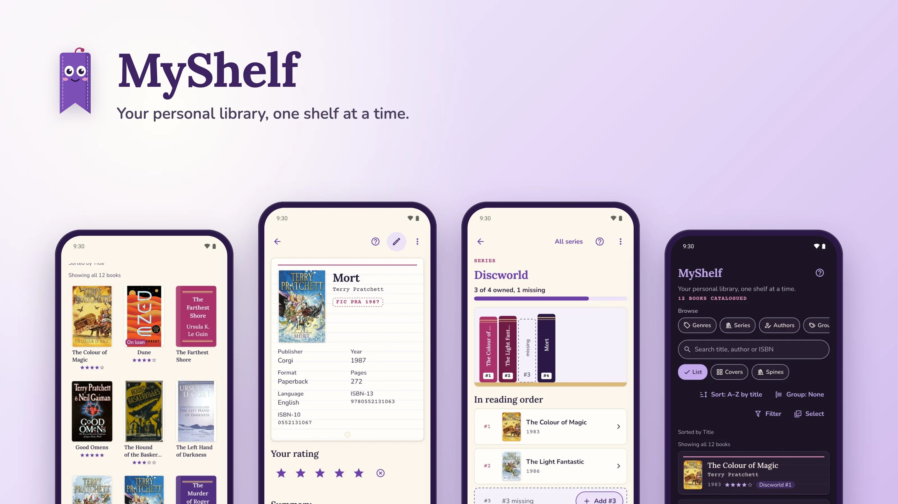

MyShelf is a free, open-source Android app for cataloguing the books you own. Scan a book's barcode, or just its cover, and MyShelf finds the edition you hold, fills in the author, year, pages, summary, genres, series and cover, and files it on your shelf. It remembers who borrowed what, reminds you when a loan is due, and shows your library as catalogue cards, a wall of covers or a shelf of spines, in a warm purple "little library" style with a helpful bookmark called **Booky**.

No accounts, no ads, no analytics, no server: your library lives on your phone.

## What it does

- **Scan a barcode or a cover.** The camera reads ISBN barcodes on the device. No barcode? Photograph the front cover: Google ML Kit's on-device text recognition reads the title and author, and MyShelf searches for them. The photo never leaves the phone; only the ISBN or the search words do.
- **Finds your edition.** Lookups go to [Open Library](https://openlibrary.org/developers/api) and, optionally, [Google Books](https://developers.google.com/books). When there is more than one match, "Which edition is yours?" lists the books and their editions, filterable by format and language, so you pick the one in your hands. You can also type an ISBN, search by title, or add a book by hand.
- **Real covers.** Covers come from Open Library and Google Books and are saved on the phone; books added without one (after an import, say) get theirs looked up in the background. A book with no cover anywhere gets a generated one in the app's style.
- **Series and positions.** MyShelf knows *Mort* is Discworld #4, shows each series as a shelf of spines in reading order, points out the gaps ("3 of 4 owned, 1 missing") and starts the missing book for you.
- **Lending with reminders.** Lend a book with a due date picked from Android's own calendar. The Loans tab stamps what's due and what's overdue and keeps a history per borrower, and optional local notifications remind you on the due date.
- **Ratings.** Rate books from one to five stars, then sort, group or filter by rating.
- **Multi-level sorting.** Sort by up to four keys at once (genre, then author, then series, then number in series…), pick a preset such as *Library order*, *Series reading order*, *Rainbow* or *Surprise me*, or save your own.
- **Browse your way.** Group the Shelf by genre, series, author, your own groups or rating; view it as a list, a grid of covers or shelves of spines; filter by genre, format, language, loan, series, year or rating; and browse genres, series, authors and groups on their own pages. Select several books at once to add them to a group or remove them, with undo.
- **Offline first.** Your library works without a connection; ISBNs scanned offline are queued and looked up when you're back online.
- **Backup and import.** Full JSON backup and restore, CSV export, and CSV import, including a Goodreads library export.
- **Booky.** A friendly bookmark who shows you around on the first run, offers tips when they're useful, answers every screen's help button, and can be turned down to Quiet or Off.
- **Light and dark.** A warm-paper light theme and a "night library" dark theme; it follows the phone, or your choice in Settings.
- **Accessible.** Every control has a role and a name for TalkBack, colours meet WCAG AA contrast, touch targets are at least 48 dp, layouts hold at 200 % text, and animation respects reduced motion. The audit: [`docs/accessibility.md`](docs/accessibility.md).
- **Ready for other languages.** Every user-facing string is in one typed catalogue with plurals and `Intl` dates and numbers; English ships today. Adding a language: [`docs/localisation.md`](docs/localisation.md).

## Screenshots

Taken on a Pixel 7 emulator (Android 16) with the app's demo library. The covers are shown as they appear in the app, loaded from Open Library.

| | | |
|:---:|:---:|:---:|
| 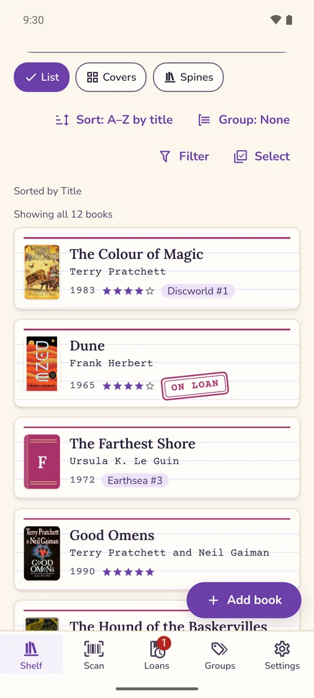 | 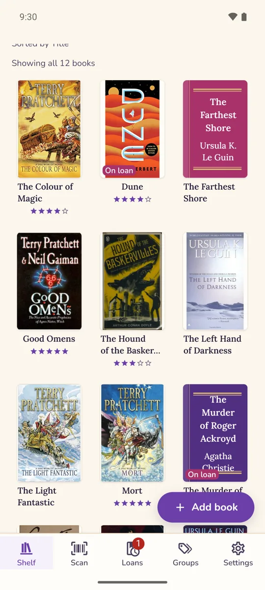 | 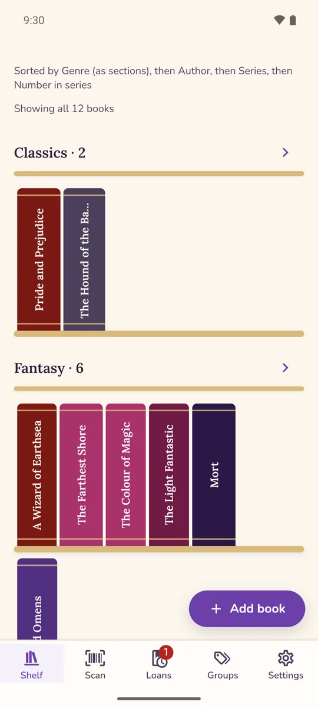 |
| **Shelf**: covers, ratings, series and loans | **Covers**: a wall of real covers | **Spines**: grouped by genre, in Library order |
| 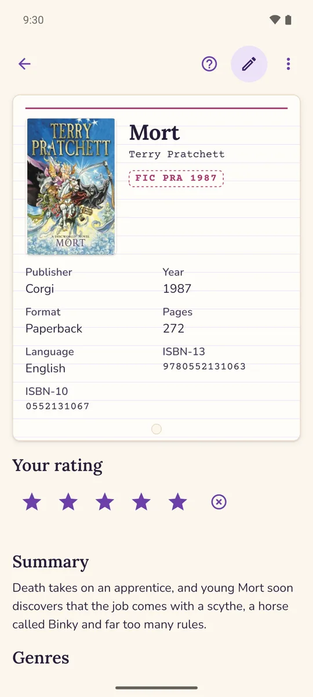 | 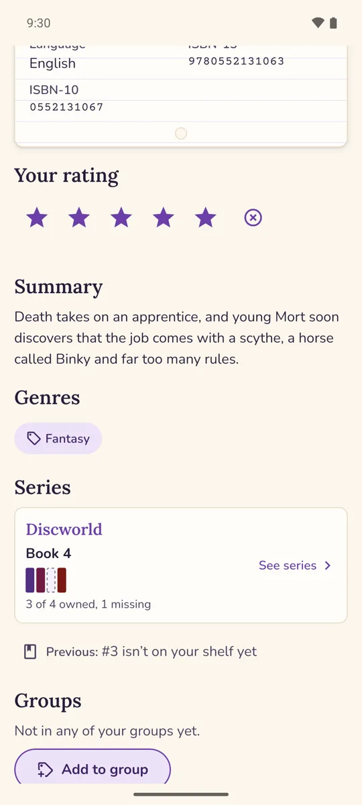 | 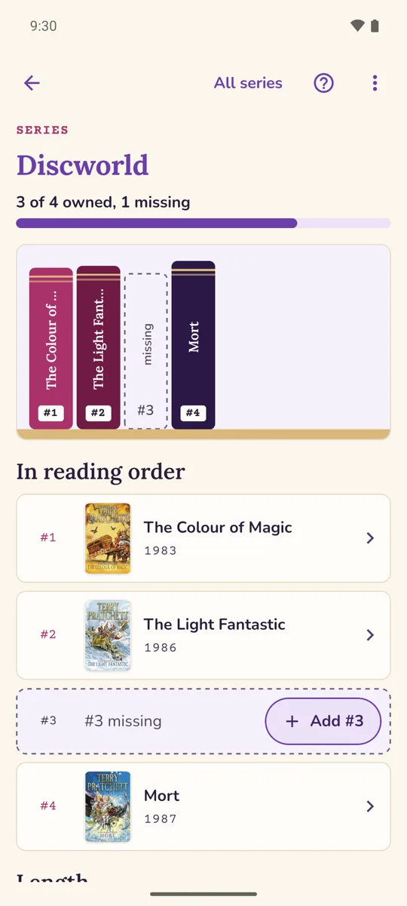 |
| **A book**: cover, details and your rating | **Its series**, gap included | **A series** in reading order |
| 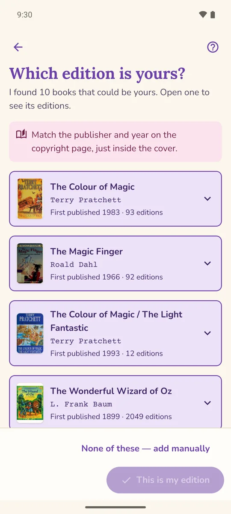 | 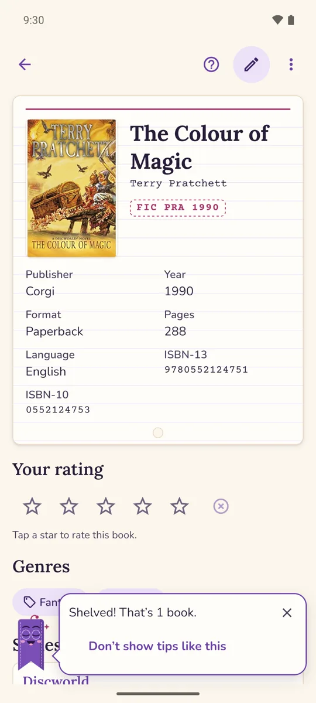 | 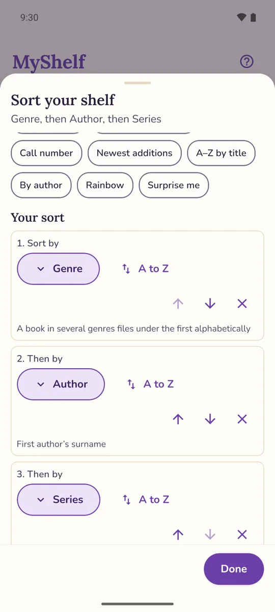 |
| **Which edition is yours?** | **Shelved**, with a tip from Booky | **Sort** by three levels |
| 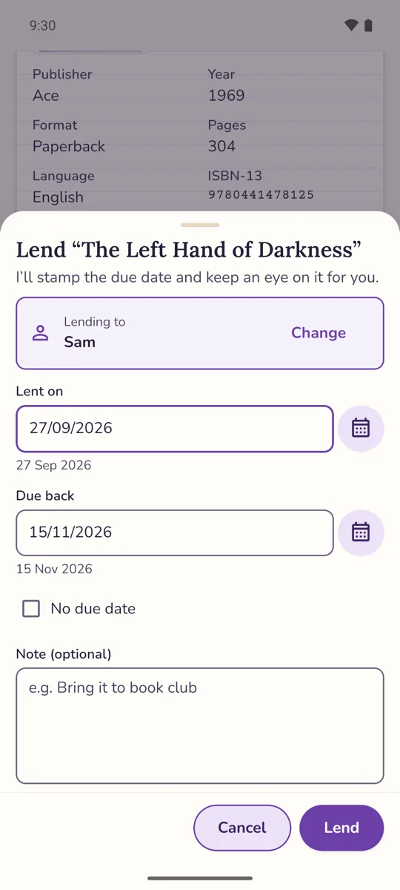 | 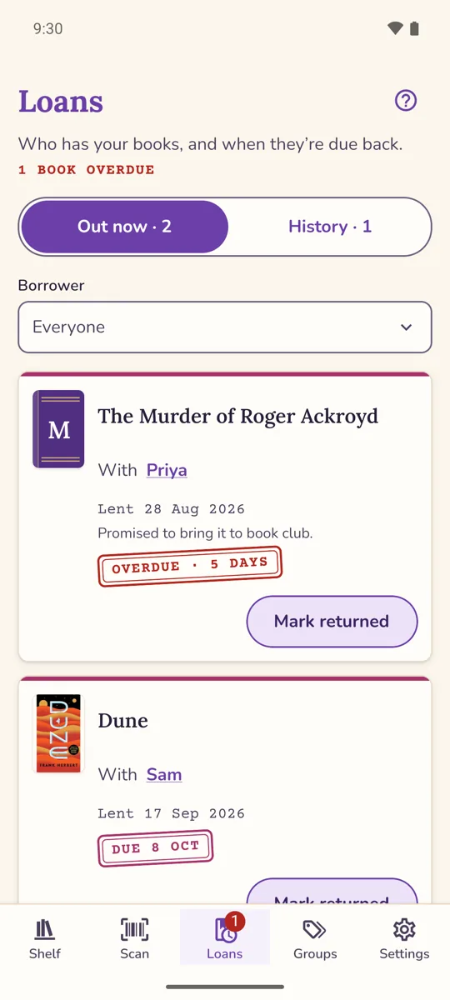 | 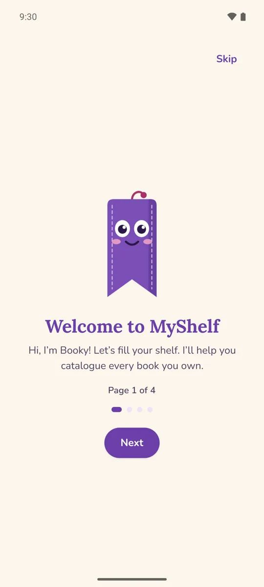 |
| **Lend** a book with a due date | **Loans**, with an overdue stamp | **Welcome**: Booky's tour |
| 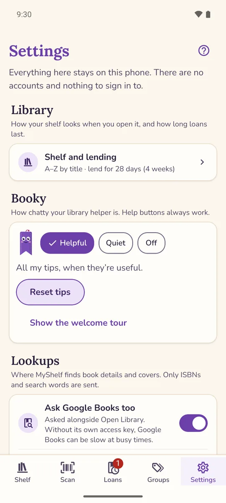 | 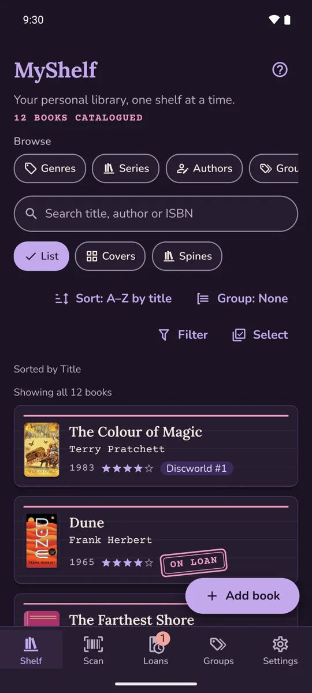 | 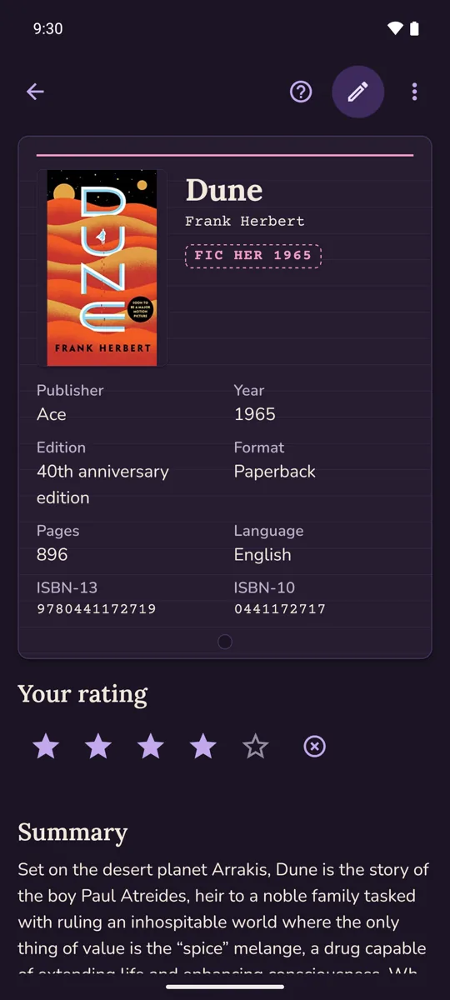 |
| **Settings** | **Dark mode**: the Shelf | **Dark mode**: a book |

<details>
<summary><b>Adding a book by its ISBN</b> (animation, 0.3 MB)</summary>
<br>
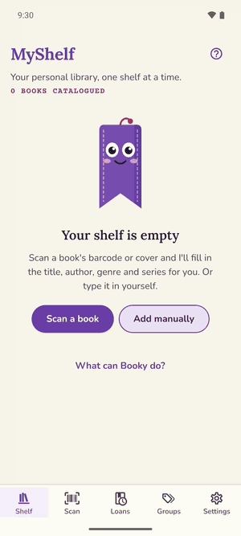

The barcode read is handed to the app by the test build here, since an emulator has no camera to point at a book; everything after it is the app talking to the live Open Library.
</details>

## Install

MyShelf is not on Google Play; you install the APK yourself ("sideloading"). It needs Android 7.0 or later.

1. **Get the APK.**
   - Released versions are on the [Releases page](https://github.com/asorichetti/MyShelf/releases), with their checksums.
   - Builds between releases are artifacts of the [Release workflow](https://github.com/asorichetti/MyShelf/actions/workflows/release.yml): open a successful run and download the `…-apks` artifact under **Artifacts** (you need to be signed in to GitHub; artifacts are kept for 30 days).
   - Take the `arm64-v8a` APK, which suits practically every phone from the last ten years; `armeabi-v7a` is for old 32-bit phones. The `.aab` is for Google Play and cannot be installed directly.
2. **Allow the install.** Open the APK on your phone, from the browser's downloads or the Files app. Android asks you to let that app install unknown apps: tap **Settings**, turn on **Allow from this source**, and go back.
3. **Install and open.** Tap **Install**, then **Open**. You can turn "Allow from this source" off again afterwards.

From a computer with USB debugging on, `adb install myshelf-<version>-arm64-v8a.apk` does the same.

A build signed with the debug key (`…-debug-signed…`) installs and runs normally, but Android will not update it with a properly signed build or the other way round: back up first (Settings → Back up your library), uninstall, install the new one and restore. Which file is which, and how releases are signed: [`docs/release.md`](docs/release.md).

## Build from source

Prerequisites: Node.js 22.13 or newer (Jest uses its built-in `node:sqlite`) and npm; for the Android app, JDK 17 and the Android SDK (Android Studio installs both) and an emulator or a phone with USB debugging.

```bash
git clone https://github.com/asorichetti/MyShelf.git
cd MyShelf
npm install
git config core.hooksPath .githooks   # enable the commit-message hook

npm run android    # build a development build, install it on an emulator or phone, and start Metro
npm run web        # or run it in the browser (the web build is what the automated UI tests drive)
```

The app has its own native module for on-device text recognition ([`modules/text-recognition`](modules/text-recognition)), so **Expo Go cannot run it**: `npm run android` (`expo run:android`) generates the native project, builds a development build with Gradle, installs it and starts Metro; later JavaScript changes reload without a rebuild. The first build takes several minutes.

Release APKs, the kind people install:

```bash
export JAVA_HOME=$(ls -d ~/Library/Java/jdk-17*/Contents/Home | head -1)   # macOS; any JDK 17
export ANDROID_HOME=$HOME/Library/Android/sdk
scripts/build-android-apk.sh production   # build/myshelf-production.apk
scripts/build-android-apk.sh e2e          # build/myshelf-e2e.apk, with the test fixture loader (never distribute)
```

Signing with your own key, CI and EAS builds: [`docs/release.md`](docs/release.md).

**Optional Google Books key.** Google Books is asked alongside Open Library, and keyless requests share a quota that is often used up. For your own, copy `.env.example` to `.env.local` and set `EXPO_PUBLIC_GOOGLE_BOOKS_API_KEY` to a free API key (Google Cloud → enable the Books API → create an API key restricted to it). `.env.local` is git-ignored; never commit a key. Google Books can also be switched off in Settings, leaving Open Library alone.

## Development

| Script | Purpose |
|---|---|
| `npm start` | start the Expo dev server |
| `npm run android` | build a development build, install it on an emulator or phone and start Metro (`expo run:android`; not Expo Go) |
| `npm run web` | open the app in a browser |
| `npm run export:web` | static web build into `dist/` |
| `npm run check` | everything CI runs for the app: the selectors and licences checks, lint, typecheck and Jest |
| `npm run lint` | ESLint |
| `npm run typecheck` | TypeScript (route links are checked strictly once the dev server has generated `.expo/types`) |
| `npm test` | Jest unit and component tests (offline; never touches the network) |
| `npm run test:live` | live checks against the real Open Library (see [Testing](#testing)) |
| `npm run selectors:gen` / `selectors:check` | regenerate / check the test ids in `src/testing/testids.gen.ts` from `src/testing/selectors.json` |
| `npm run licences:gen` / `licences:check` | regenerate / check the list of open-source licences shown in About |
| `npm run autotest:install-browser` | once: install Chromium for the auto test suite |
| `npm run autotest:check` | typecheck and unit tests for the auto test suite |
| `npm run -s autotest:smoke` | the core journeys with UX gates enforced (needs the web server: `CI=1 npx expo start --web --port 8081`) |
| `npm run -s autotest:journeys` | every journey |
| `npm run -s autotest -- <command>` | any auto test suite command, e.g. `navigate --url /` |
| `npm run icons:render` | render the app icon, splash and store graphics from `assets/source/*.svg` |
| `npm run media:hero` | render the README's hero image from the screenshots in `docs/media/` |

Contributors start with [`AGENTS.md`](AGENTS.md): picking up a card from [`STATUS.md`](STATUS.md), the commands and the conventions.

## Testing

MyShelf is tested at three levels, which share one list of test ids ([`src/testing/selectors.json`](src/testing/selectors.json)) so they agree on what they look for:

1. **Jest** (`npm test`): every module, from pure domain helpers to whole screens with Testing Library. Database repositories run against a real in-memory SQLite database (Node's `node:sqlite`); network calls use recorded API fixtures, so the suite is offline and repeatable.
2. **The auto test suite** ([`tools/auto-test-suite`](tools/auto-test-suite/README.md)): a TypeScript and Playwright command-line tool that drives the web build through scripted journeys. Every run prints JSON and saves an evidence bundle (screenshot, rendered DOM, console and network logs, gate results), and applies UX gates for page state, rendering, console errors, failed requests and accessibility.
3. **Maestro on Android**: YAML flows in [`.maestro/`](.maestro/README.md) run on an emulator or a phone against release builds, for what only the real app can show: the camera permission, ML Kit reading a cover, the native date picker, reminders delivered on a loan's due date, the share sheet and document picker for backups and imports, dark mode, 200 % text, airplane mode, rotation and process death. `scripts/maestro-suite.sh` puts the phone in a known state and runs them all:

   ```bash
   scripts/maestro-suite.sh --e2e-apk build/myshelf-e2e.apk \
     --production-apk build/myshelf-production.apk --device emulator-5554
   ```

   Setting up the emulator, and the results of the last device regression: [`docs/device-testing.md`](docs/device-testing.md).

**Live checks** (`npm run test:live`) call the real Open Library to prove that well-known books get real cover art, that the batch cover search works, and that text read from real cover photos finds the right book. They need the network, so they are not part of `npm test`.

In CI ([`.github/workflows`](.github/workflows)), every pull request and every push to `main` runs `npm run check`, the auto test suite's own checks, the smoke run and every other journey with the gates set to fail. The live checks and the whole Maestro suite on an Android emulator run weekly, and the Release workflow builds and signs the APKs and the App Bundle. The strategy in full: [`PLAN.md` §10](PLAN.md#10-testing-strategy).

## Project structure

```
src/
  app/          screens and navigation (Expo Router, file-based routes)
  features/     each feature's screens, hooks and state: shelf, book, scan, lookup,
                loans, series, groups, genres, authors, covers, booky, settings…
  components/   the UI kit (buttons, sheets, cards, spines, stamps) and Booky
  db/           SQLite schema, versioned migrations and repositories
  domain/       pure logic: ISBNs, sorting, series gaps, call numbers, dates
  services/     metadata lookups, covers, text recognition, backup and CSV,
                reminders, the HTTP client
  i18n/         the string catalogue and t()
  theme/        colour tokens, typography and spacing (light and dark)
  testing/      selectors, fixtures and test helpers
modules/text-recognition/   local Expo module wrapping ML Kit text recognition
plugins/                    Expo config plugins (signing, ABI splits, R8, Android text fixes)
tools/auto-test-suite/      the Playwright-based UI test tool
.maestro/                   device flows
scripts/                    build, test and asset scripts
docs/                       ADRs, phase plans, privacy, release, device testing, accessibility
```

Design decisions are recorded as ADRs in [`docs/adr/`](docs/adr/); the architecture, data model and design system are in [`PLAN.md`](PLAN.md), and progress in [`STATUS.md`](STATUS.md).

**Tech:** [Expo](https://expo.dev) SDK 57, React Native 0.86 and React 19 in strict TypeScript; Expo Router; SQLite via `expo-sqlite`; `expo-camera` for barcodes; Google ML Kit for on-device text recognition; Jest, Testing Library, Playwright and Maestro; GitHub Actions.

## Privacy

MyShelf has no accounts, no analytics and no ads, and nothing is uploaded: your library, photos and loans stay on your phone. The only network requests are lookups to Open Library and Google Books, carrying ISBNs, search words or cover ids, never your library. Reminders are local notifications, and backups and exports go wherever you save them. The full policy, checked against the code: [`docs/privacy.md`](docs/privacy.md).

## Licence

[MIT](LICENSE) © 2026 Alex Sorichetti.

Book data and covers courtesy of [Open Library](https://openlibrary.org) (Internet Archive) and [Google Books](https://books.google.com). The covers in the screenshots belong to their publishers and artists and appear only as the app displays them.
