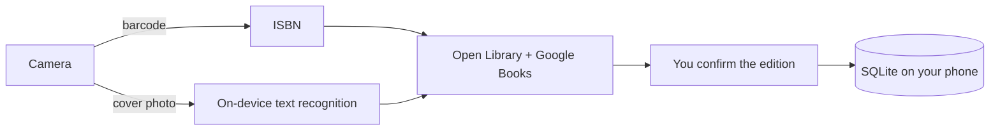

# MyShelf

**Your personal library, one shelf at a time.**

MyShelf is a free, open-source Android app for cataloguing the books you own. Scan a book's barcode — or just its cover — and MyShelf finds the exact edition, fills in the author, year, genre, summary and series, and files it on your shelf. It keeps track of who you've lent books to, lets you browse by genre, series, author or your own groups, and does it all in a cosy purple "little library" style with a friendly bookmark helper called **Booky**.

No accounts, no ads, no subscriptions, no server: your library lives on your phone.

> **Status:** early development. The app scaffold, routing, web test target, Jest, the test-id contract, the auto test suite and CI are in place; the rest of the foundation phase (theme, Booky, tabs, database, Maestro, linting) is in progress. See [`STATUS.md`](STATUS.md) for the live checklist.

---

## Planned features

- **Scan to catalogue** — barcode (ISBN) scanning identifies the exact edition; no barcode? Photograph the cover and on-device text recognition finds the book, then you pick your edition from a list.
- **Rich details** — title, authors, publisher, publication year, page count, a brief summary, cover, and genres you can edit.
- **Series aware** — knows that *Guards! Guards!* is Discworld #8, shows your series in order, and points out the gaps.
- **Lending tracker** — who has which book, since when, when it's due; overdue books get a library-style stamp and an optional reminder.
- **Browse your way** — group by genre, series, author or your own groups; view as catalogue cards, a wall of covers, or a shelf of spines.
- **Booky** — a helpful bookmark who shows you around, explains things when you ask, and stays quiet when you'd rather it did.
- **Backup and import** — full JSON backup/restore, CSV export, and CSV import (including a Goodreads export).
- **Accessible** — WCAG AA colour contrast, TalkBack support, large-text layouts, reduce-motion support; light and dark themes.

## How it works



Recognition runs on the device; the only network traffic is ISBN or title lookups to [Open Library](https://openlibrary.org/developers/api) and [Google Books](https://developers.google.com/books), both free and used without API keys. Everything else stays on your phone.

## Tech stack

| | |
|---|---|
| App | [Expo](https://expo.dev) SDK 57, React Native 0.86, React 19, TypeScript (strict) |
| Navigation | Expo Router (file-based routes in `src/app`) |
| Data | SQLite via `expo-sqlite`, versioned migrations, repository layer |
| Recognition | `expo-camera` barcode scanning, Google ML Kit on-device text recognition |
| Metadata | Open Library and Google Books APIs |
| Testing | Jest + Testing Library; the auto test suite (TypeScript + Playwright) against the web build; Maestro on device |
| CI / release | GitHub Actions; local or EAS free-tier Android builds |

Design decisions are recorded as ADRs in [`docs/adr/`](docs/adr/).

## Getting started

Prerequisites: Node.js 22 or newer and npm. For the Android app: Android Studio with an emulator, or an Android phone with USB debugging.

```bash
git clone https://github.com/asorichetti/MyShelf.git
cd MyShelf
npm install
git config core.hooksPath .githooks   # enable the commit-message hook

npm run web        # run in the browser (the web build is used for automated UI tests)
npm run android    # run on an emulator or device
```

From Phase 03 onward the app uses a native text-recognition module, so it needs a development build (`npx expo run:android`) rather than Expo Go.

## Scripts

| Script | Purpose |
|---|---|
| `npm start` | start the Expo dev server |
| `npm run android` / `npm run web` | open the app on Android or in a browser |
| `npm run export:web` | static web build into `dist/` |
| `npm run typecheck` | TypeScript check |
| `npm test` | Jest unit and component tests |
| `npm run selectors:gen` | regenerate the test ids in `src/testing/testids.gen.ts` from `src/testing/selectors.json` |
| `npm run selectors:check` | fail if the generated test id file is stale |
| `npm run check` | everything CI runs for the app: selectors check, typecheck and tests |
| `npm run autotest:install-browser` | one time: install Chromium for the auto test suite |
| `npm run autotest:check` | typecheck and unit tests for the auto test suite |
| `npm run -s autotest:smoke` | run the core journeys with UX gates enforced (needs the web server: `CI=1 npx expo start --web --port 8081`) |
| `npm run -s autotest:journeys` | run every journey |
| `npm run -s autotest -- <command>` | run any auto test suite command, e.g. `navigate --url /` |

## Testing

MyShelf is tested at three levels:

1. **Jest** — every module, from pure domain helpers to screens. Database repositories run against a real in-memory SQLite database; network calls use recorded API fixtures.
2. **Auto test suite** — a TypeScript + Playwright command-line tool ([`tools/auto-test-suite`](tools/auto-test-suite/README.md)) that drives the web build through scripted journeys. Every run prints JSON and saves an evidence bundle (screenshot, rendered DOM, console and network logs, gate results), and applies UX gates for page state, rendering, console errors, network failures and accessibility.
3. **Maestro** — YAML flows on an Android emulator or device for the camera, text recognition and other native features.

Test ids come from a single [`src/testing/selectors.json`](src/testing/selectors.json), generated into one TypeScript module used by the app, Jest and the auto test suite, so all three levels agree. No change is done until `npm run check` and the UI smoke run with gates enforced are green. The full strategy is in [`PLAN.md`](PLAN.md#10-testing-strategy).

## Project docs

- [`PLAN.md`](PLAN.md) — architecture, data model, APIs, design system, testing strategy, phases
- [`STATUS.md`](STATUS.md) — progress checklist
- [`docs/plan/`](docs/plan/) — detailed task cards for each phase
- [`docs/adr/`](docs/adr/) — architecture decision records
- [`AGENTS.md`](AGENTS.md) — contributor guide: how to pick up work, commands and conventions

## Contributing

Issues and pull requests are welcome. Start with [`AGENTS.md`](AGENTS.md): pick a card from [`STATUS.md`](STATUS.md), follow its phase document, and make sure the regression gate is green.

## Licence

[MIT](LICENSE) © 2026 Alex Sorichetti.

Book data courtesy of [Open Library](https://openlibrary.org) (Internet Archive) and [Google Books](https://books.google.com).
